# Database Architecture

**Engine**: MySQL 8.0 / InnoDB (production) · SQLite 3 (local & sandbox driver, identical logical schema)
**Charset**: `utf8mb4` / `utf8mb4_unicode_ci` — full Persian + emoji support
**Naming**: snake_case, plural table names, singular FKs (`project_id`), portable column names (no reserved words: `group_key`, `key_name`, `type_name`)

The schema is declared **once**, dialect-agnostically, in `backend/database/schema.php`; `backend/database/Migrator.php` emits the MySQL or SQLite DDL from that single source of truth, so both drivers always stay in sync.

---

## Conventions

| Concern | Rule |
| --- | --- |
| Primary keys | `id` — `BIGINT UNSIGNED AUTO_INCREMENT` (SQLite: `INTEGER PRIMARY KEY AUTOINCREMENT`) |
| Timestamps | `created_at`, `updated_at` (`DATETIME`, UTC) on every table |
| Status | `is_active TINYINT(1) DEFAULT 1` (publish/unpublish) or `status` enum for editorial workflow |
| Ordering | `sort_order INT DEFAULT 0` + index on `(is_active, sort_order)` for drag-and-drop ordering |
| Slug uniqueness | `UNIQUE(lang, slug)` **per translation table** — one slug per language |
| Referential integrity | `ON DELETE CASCADE` for translations/children, `ON DELETE SET NULL` for optional media/FK |
| Indexing | every FK, every filter/sort combination, every slug lookup, `published_at`/`created_at` for feeds |
| Soft deletes | not used; deletions are explicit (admin confirmation), media usage is checked before delete |
| Multilingual | base table = structural/shared data · `*_translations` = human-readable data (`UNIQUE(entity_id, lang)`) |

---

## Entity groups

### 1. Identity & access

**`admins`** — CMS operators
`id`, `name` VARCHAR(120), `email` VARCHAR(190) **UQ**, `password_hash` VARCHAR(255), `role` ENUM(`super_admin`,`admin`,`editor`), `avatar_media_id` FK→media, `bio` VARCHAR(500), `is_active` TINYINT, `must_change_password` TINYINT, `last_login_at` DATETIME, `last_login_ip` VARCHAR(45), `failed_attempts` INT, `locked_until` DATETIME, `remember_token` VARCHAR(100), timestamps
*Indexes*: `email` UQ · `role`, `is_active`

**`admin_sessions`** — DB-backed sessions (policy: idle 120 min, absolute 14 days)
`id` VARCHAR(64) **PK** (random, hashed in cookie), `admin_id` FK→admins **CASCADE**, `ip` VARCHAR(45), `user_agent` VARCHAR(255), `payload` TEXT, `last_activity` DATETIME, `created_at`
*Indexes*: `admin_id`, `last_activity`

**`login_attempts`** — brute-force forensics + back-off
`id`, `email` VARCHAR(190), `ip` VARCHAR(45), `successful` TINYINT, `created_at`
*Indexes*: `(email, created_at)`, `(ip, created_at)`

**`password_resets`** — single-use, hashed, expiring tokens
`id`, `admin_id` FK→admins **CASCADE**, `token_hash` VARCHAR(255), `expires_at` DATETIME, `used_at` DATETIME, `created_at`
*Indexes*: `admin_id`, `token_hash`

### 2. Configuration & localisation

**`languages`** — drives routing, admin editors, hreflang, sitemap
`id`, `code` VARCHAR(8) **UQ** (`fa`,`en`,…), `name` VARCHAR(64), `native_name` VARCHAR(64), `direction` ENUM(`ltr`,`rtl`), `flag` VARCHAR(16), `is_default` TINYINT, `is_active` TINYINT, `sort_order`

**`settings`** / **`setting_translations`** — grouped key/value site configuration
`settings`: `id`, `group_key` VARCHAR(40), `key_name` VARCHAR(100) **UQ**, `value_type` ENUM(`string`,`text`,`bool`,`int`,`json`,`html`,`media`,`color`), `value` TEXT, `is_public` TINYINT, timestamps
`setting_translations`: `id`, `setting_id` FK **CASCADE**, `lang`, `value` TEXT, **UQ**(`setting_id`,`lang`)
Groups: `identity`, `contact`, `social`, `seo`, `appearance`, `analytics`, `integrations`, `system`
Public settings (`is_public=1`) are exposed through `/api/v1/bootstrap`; private ones (SMTP credentials, analytics keys) only in the admin panel.

**`translations`** / **`translation_values`** — persisted UI strings (interface labels per language)
`translations`: `id`, `key_name` VARCHAR(150) **UQ**, `group_key` VARCHAR(40), timestamps
`translation_values`: `id`, `translation_id` FK **CASCADE**, `lang`, `value` TEXT, **UQ**(`translation_id`,`lang`)

### 3. Structure & navigation

**`pages`** / **`page_translations`** — the routable page registry
`pages`: `id`, `key_name` VARCHAR(60) **UQ** (`home`,`about`,`services`,`projects`,`experience`,`blog`,`contact`,`resume`), `template` VARCHAR(60), `is_active`, `sort_order`
`page_translations`: `id`, `page_id` FK **CASCADE**, `lang`, `title`, `subtitle`, `content` MEDIUMTEXT, `seo_title`, `seo_description`, **UQ**(`page_id`,`lang`)

**`sections`** / **`section_translations`** — homepage & page section builder
`sections`: `id`, `page_id` FK **CASCADE**, `key_name` VARCHAR(60), `type_name` VARCHAR(40) (`hero`,`about`,`skills`,`services`,`projects`,`experience`,`testimonials`,`blog`,`stats`,`cta`,`contact`,`custom`), `is_active`, `sort_order`, `settings_json` TEXT, **UQ**(`page_id`,`key_name`)
`section_translations`: `id`, `section_id` FK **CASCADE**, `lang`, `eyebrow`, `title`, `subtitle`, `body` MEDIUMTEXT, `cta_label`, `cta_url`, `cta2_label`, `cta2_url`, `items_json` TEXT, **UQ**(`section_id`,`lang`)
Changing `is_active`/`sort_order`/copy here instantly reshapes the public homepage — no code change.

**`navigation`** / **`navigation_translations`** — header + footer menus, nested
`navigation`: `id`, `location` ENUM(`header`,`footer_quick`,`footer_services`,`footer_company`,`footer_legal`), `parent_id` FK→navigation **SET NULL**, `type_name` ENUM(`route`,`url`,`page`,`project_category`,`blog_category`,`anchor`), `target_value` VARCHAR(255), `icon` VARCHAR(60), `open_in_new_tab` TINYINT, `is_active`, `sort_order`
`navigation_translations`: `id`, `navigation_id` FK **CASCADE**, `lang`, `label` VARCHAR(120), **UQ**(`navigation_id`,`lang`)

**`social_links`** / **`social_link_translations`**
`social_links`: `id`, `platform` VARCHAR(40), `url` VARCHAR(255), `icon` VARCHAR(60), `is_active`, `sort_order`
`social_link_translations`: `id`, `social_link_id` FK **CASCADE**, `lang`, `label` VARCHAR(80), `handle` VARCHAR(80), **UQ**(`social_link_id`,`lang`)

### 4. Portfolio content

**`skill_categories`** / **`skill_category_translations`**
`skill_categories`: `id`, `key_name` VARCHAR(60) **UQ**, `icon`, `is_active`, `sort_order`
`skill_category_translations`: `id`, `category_id` FK **CASCADE**, `lang`, `name`, `description`, **UQ**(`category_id`,`lang`)

**`skills`** / **`skill_translations`** — backs both *Skills* and *Technologies* admin screens
`skills`: `id`, `category_id` FK **SET NULL**, `kind` ENUM(`skill`,`technology`), `icon`, `level` TINYINT (0-100), `proficiency` VARCHAR(40), `years` VARCHAR(20), `color` VARCHAR(20), `is_featured` TINYINT (hero badges / marquee), `is_active`, `sort_order`
`skill_translations`: `id`, `skill_id` FK **CASCADE**, `lang`, `name`, `description`, **UQ**(`skill_id`,`lang`)

**`services`** / **`service_translations`**
`services`: `id`, `icon`, `accent` VARCHAR(20), `is_featured`, `is_active`, `sort_order`
`service_translations`: `id`, `service_id` FK **CASCADE**, `lang`, `title`, `slug`, `summary`, `description`, `features_json` (bullet list), **UQ**(`service_id`,`lang`), **UQ**(`lang`,`slug`)

**`project_categories`** / **`project_category_translations`**
`project_categories`: `id`, `icon`, `color`, `is_active`, `sort_order`
`project_category_translations`: `id`, `category_id` FK **CASCADE**, `lang`, `name`, `slug`, `description`, **UQ**(`category_id`,`lang`), **UQ**(`lang`,`slug`)

**`projects`** + `project_translations` + `project_images` + `project_technologies`
`projects`: `id`, `category_id` FK **SET NULL**, `client`, `project_url`, `github_url`, `cover_media_id` FK **SET NULL**, `tech_stack` VARCHAR(400) (display pills), `started_at` DATE, `completed_at` DATE, `is_featured`, `is_active`, `sort_order`, `views` INT
`project_translations`: `id`, `project_id` FK **CASCADE**, `lang`, `title`, `slug`, `summary`, `description`, `challenge`, `solution`, `results`, `seo_title`, `seo_description`, **UQ**(`project_id`,`lang`), **UQ**(`lang`,`slug`)
`project_images`: `id`, `project_id` FK **CASCADE**, `media_id` FK **CASCADE**, `caption`, `sort_order`
`project_technologies`: `id`, `project_id` FK **CASCADE**, `skill_id` FK **CASCADE**, `sort_order`, **UQ**(`project_id`,`skill_id`)

**`experiences`** / **`experience_translations`** — employment timeline
`experiences`: `id`, `company`, `company_url`, `company_logo_media_id` FK **SET NULL**, `location`, `employment_type` ENUM(`full_time`,`part_time`,`contract`,`freelance`,`internship`), `start_date` DATE, `end_date` DATE, `is_current` TINYINT, `is_active`, `sort_order`
`experience_translations`: `id`, `experience_id` FK **CASCADE**, `lang`, `position`, `description`, `responsibilities_json`, `achievements_json`, **UQ**(`experience_id`,`lang`)

**`education`** / **`education_translations`**
`education`: `id`, `institution`, `institution_url`, `logo_media_id` FK **SET NULL**, `location`, `start_date`, `end_date`, `is_current`, `gpa`, `is_active`, `sort_order`
`education_translations`: `id`, `education_id` FK **CASCADE**, `lang`, `degree`, `field`, `description`, **UQ**(`education_id`,`lang`)

**`certifications`** / **`certification_translations`**
`certifications`: `id`, `issuer`, `issuer_url`, `credential_id`, `credential_url`, `image_media_id` FK **SET NULL**, `issue_date` DATE, `expiry_date` DATE, `is_active`, `sort_order`
`certification_translations`: `id`, `certification_id` FK **CASCADE**, `lang`, `title`, `description`, **UQ**(`certification_id`,`lang`)

**`testimonials`** / **`testimonial_translations`**
`testimonials`: `id`, `avatar_media_id` FK **SET NULL**, `rating` TINYINT (1-5), `lang` VARCHAR(8) (language the quote was given in), `is_featured`, `is_active`, `sort_order`
`testimonial_translations`: `id`, `testimonial_id` FK **CASCADE**, `lang`, `client_name`, `client_position`, `company`, `quote` MEDIUMTEXT, **UQ**(`testimonial_id`,`lang`)

### 5. Editorial (blog)

**`blog_categories`** / **`blog_category_translations`** — same shape as project categories
**`blog_tags`** / **`blog_tag_translations`**: `id`, `is_active` + translated `name`, `slug`
**`blog_posts`**: `id`, `category_id` FK **SET NULL**, `author_id` FK→admins **SET NULL**, `cover_media_id` FK **SET NULL**, `status` ENUM(`draft`,`published`,`scheduled`), `published_at` DATETIME, `is_featured`, `allow_comments`, `views` INT, `reading_time` TINYINT, `canonical_url`, `og_image_media_id` FK **SET NULL**, `sort_order`
*Indexes*: `(status, published_at)`, `category_id`, `is_featured`
**`blog_post_translations`**: `id`, `post_id` FK **CASCADE**, `lang`, `title`, `slug`, `excerpt`, `content` MEDIUMTEXT (Markdown), `seo_title`, `seo_description`, `keywords`, **UQ**(`post_id`,`lang`), **UQ**(`lang`,`slug`)
**`blog_post_tags`**: `id`, `post_id` FK **CASCADE**, `tag_id` FK **CASCADE**, **UQ**(`post_id`,`tag_id`)

### 6. Operations

**`media`** / **`media_translations`** — media library
`media`: `id`, `filename` VARCHAR(200), `original_name` VARCHAR(200), `path` VARCHAR(255) (`2026/01/c3f9…-shot.webp`), `url` VARCHAR(320), `mime_type` VARCHAR(100), `extension` VARCHAR(12), `size` INT (bytes), `width` INT, `height` INT, `folder` VARCHAR(120), `uploaded_by` FK→admins **SET NULL**
`media_translations`: `id`, `media_id` FK **CASCADE**, `lang`, `alt_text` VARCHAR(300), `caption` VARCHAR(300), **UQ**(`media_id`,`lang`)
*Indexes*: `folder`, `mime_type`, `created_at`

**`messages`** — contact-form inbox
`id`, `name`, `email`, `phone`, `company`, `subject`, `message` MEDIUMTEXT, `budget`, `service_interest`, `ip` VARCHAR(45), `user_agent`, `locale`, `is_read`, `is_starred`, `is_archived`, `replied_at`, `notes` TEXT
*Indexes*: `(is_read, created_at)`, `email`

**`resumes`** — downloadable CV files per language
`id`, `lang` VARCHAR(8), `title`, `file_media_id` FK **SET NULL**, `file_path` VARCHAR(255), `version`, `is_primary`, `is_active`, `downloads` INT
*Indexes*: `(lang, is_active)`

**`seo_metadata`** — per entity/language SEO overrides
`id`, `entity_type` ENUM(`global`,`page`,`section`,`project`,`post`,`service`,`experience`,`home`), `entity_id` BIGINT, `lang`, `seo_title`, `meta_description`, `keywords`, `canonical_url`, `robots`, `og_title`, `og_description`, `og_image_media_id` FK **SET NULL**, `twitter_card`, `schema_json` TEXT
*Indexes*: **UQ**(`entity_type`,`entity_id`,`lang`)

**`analytics_visits`** — privacy-friendly view counter powering the dashboard chart
`id`, `path`, `lang`, `entity_type`, `entity_id`, `ip_hash` VARCHAR(64) (sha1 of ip+secret, no raw IP), `user_agent`, `referrer`, `created_at`
*Indexes*: `created_at`, `(entity_type, entity_id)`

---

## Relationship overview

```mermaid
erDiagram
    languages ||--o{ page_translations : "lang"
    pages ||--o{ page_translations : has
    pages ||--o{ sections : contains
    sections ||--o{ section_translations : has

    skill_categories ||--o{ skills : groups
    skills ||--o{ skill_translations : has
    skills ||--o{ project_technologies : tagged
    services ||--o{ service_translations : has

    project_categories ||--o{ projects : classifies
    project_categories ||--o{ project_category_translations : has
    projects ||--o{ project_translations : has
    projects ||--o{ project_images : gallery
    projects ||--o{ project_technologies : uses

    experiences ||--o{ experience_translations : has
    education ||--o{ education_translations : has
    certifications ||--o{ certification_translations : has
    testimonials ||--o{ testimonial_translations : has

    blog_categories ||--o{ blog_posts : classifies
    blog_posts ||--o{ blog_post_translations : has
    blog_posts ||--o{ blog_post_tags : tagged
    blog_tags ||--o{ blog_post_tags : used

    media ||--o{ media_translations : has
    media ||--o{ projects : "cover / gallery"
    media ||--o{ blog_posts : cover
    media ||--o{ admins : avatar

    admins ||--o{ admin_sessions : owns
    admins ||--o{ blog_posts : authors
    navigation ||--o{ navigation_translations : has
    social_links ||--o{ social_link_translations : has
    resumes }o--|| languages : "lang"
    seo_metadata }o--|| languages : "lang"
```



---

## Query patterns (all prepared statements)

```sql
-- 1. Public project list for one language with fallback + category name + gallery count
SELECT p.id, p.is_featured, p.completed_at, p.tech_stack,
       t.title, t.slug, t.summary,
       COALESCE(f.title, t.title) AS title_fallback,
       c.slug AS category_slug, ct.name AS category_name,
       m.url AS cover_url, m.width, m.height,
       (SELECT COUNT(*) FROM project_images pi WHERE pi.project_id = p.id) AS gallery_count
FROM projects p
JOIN project_translations t      ON t.project_id = p.id AND t.lang = :lang
LEFT JOIN project_translations f ON f.project_id = p.id AND f.lang = :fallback
LEFT JOIN project_categories c   ON c.id = p.category_id
LEFT JOIN project_category_translations ct
                                 ON ct.category_id = c.id AND ct.lang = :lang
LEFT JOIN media m                ON m.id = p.cover_media_id
WHERE p.is_active = 1 AND (:category IS NULL OR c.slug = :category)
ORDER BY p.is_featured DESC, p.sort_order ASC, p.completed_at DESC
LIMIT :limit OFFSET :offset;

-- 2. Bilingual slug mapping (used by the language switcher)
SELECT t.lang, t.slug
FROM project_translations t
WHERE t.project_id = (SELECT project_id FROM project_translations WHERE lang = :from AND slug = :slug);

-- 3. Dashboard counters (single round-trip)
SELECT
  (SELECT COUNT(*) FROM projects          WHERE is_active = 1) AS projects_published,
  (SELECT COUNT(*) FROM projects)                              AS projects_total,
  (SELECT COUNT(*) FROM blog_posts WHERE status = 'published') AS posts_published,
  (SELECT COUNT(*) FROM messages WHERE is_read = 0)            AS unread_messages,
  (SELECT COUNT(*) FROM skills   WHERE is_active = 1)          AS skills,
  (SELECT COUNT(*) FROM services WHERE is_active = 1)          AS services;
```

## Seeding

`database/install.php` creates the schema then runs ordered seeders (`seeds/01_languages.php` … `seeds/12_blog.php`) that insert a complete bilingual demo dataset — every entity in Persian **and** English, so both locales render fully populated pages on first run and the admin panel is immediately explorable.
