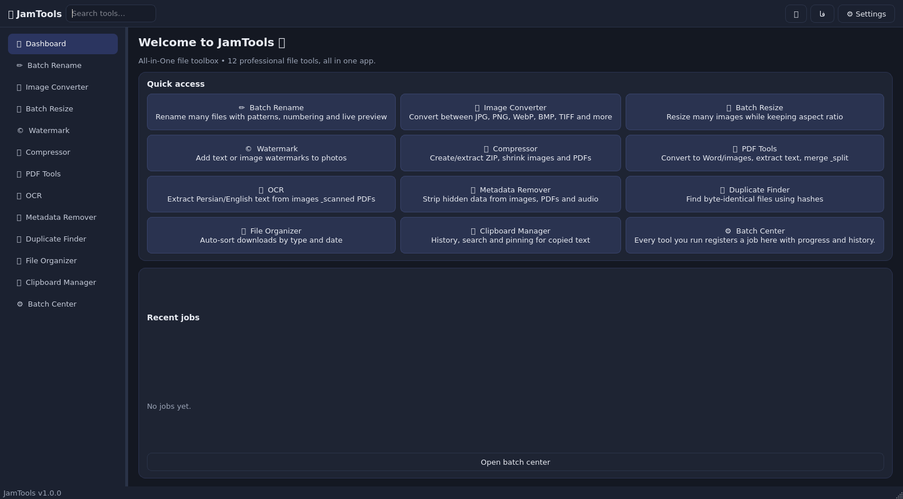
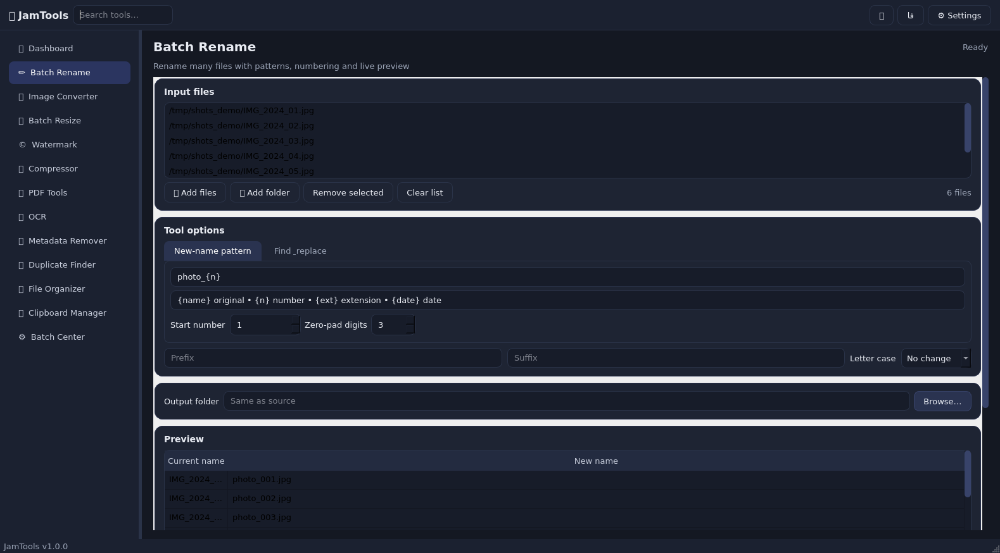
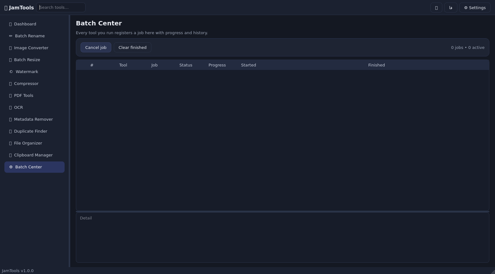

# 🧰 JamTools — جعبه‌ابزار همه‌کاره فایل (All-in-One File Toolbox)

<div dir="rtl">

**JamTools** یک برنامه دسکتاپ ویندوزی با **Python + PySide6** است که ۱۲ ابزار حرفه‌ای مدیریت فایل را در یک رابط یکپارچه، دوزبانه (فارسی/English) و تیره/روشن جمع کرده است.

> اسکرین‌شات‌ها به انگلیسی گرفته شده‌اند (سندباکس فونت فارسی نداشت)؛ نسخه فارسی دقیقاً همین ظاهر را با چیدمان راست‌به‌چپ دارد.

| داشبورد | تغییر نام گروهی |
|---|---|
|  |  |

## ✨ ابزارها

| # | ابزار | امکانات |
|---|-------|---------|
| ۱ | ✏️ تغییر نام گروهی | الگو (`{name}`، `{n}`، `{date}`…)، جست‌وجو/جایگزینی (حتی Regex)، پیشوند/پسوند، پیش‌نمایش زنده، اجرای امن دومرحله‌ای |
| ۲ | 🖼️ تبدیل فرمت تصاویر | JPG ،PNG ،WebP ،BMP ،TIFF ،GIF ،ICO با کنترل کیفیت |
| ۳ | 📐 تغییر اندازه گروهی | بر اساس حداکثر ضلع یا عرض/ارتفاع، حالت‌های Fit / Fill / Exact |
| ۴ | ©️ واترمارک | متنی یا لوگو، ۵ موقعیت، شفافیت، اندازه نسبی، حالت کاشی‌وار |
| ۵ | 🗜️ فشرده‌سازی | ساخت/بازکردن ZIP، کم‌کردن حجم تصاویر و PDF |
| ۶ | 📕 ابزارهای PDF | تبدیل به عکس و Word، استخراج متن، ادغام، تقسیم صفحه‌به‌صفحه |
| ۷ | 🔤 تشخیص متن (OCR) | فارسی + انگلیسی از عکس و PDF اسکن‌شده (با Tesseract) |
| ۸ | 🧹 حذف متادیتا | نمایش و پاک‌سازی اطلاعات مخفی عکس، PDF و فایل صوتی |
| ۹ | 👯 فایل‌های تکراری | اسکن با هش SHA-256، انتخاب هوشمند قربانی، انتقال/حذف گروهی |
| ۱۰ | 🗂️ مرتب‌ساز فایل | دسته‌بندی Downloads بر اساس نوع/پسوند/ماه + پیش‌نمایش و **Undo** |
| ۱۱ | 📋 مدیر کلیپ‌برد | نظارت زنده، تاریخچه SQLite، جست‌وجو، سنجاق، پشتیبانی از عکس |
| ۱۲ | ⚙️ مرکز پردازش گروهی | صف سراسری کارها با پیشرفت زنده، لغو و تاریخچه |

## 🚀 اجرا (ویندوز)

```powershell
cd jamtools
py -m venv .venv
.venv\Scripts\activate
pip install -r requirements.txt
python run.py
```

فقط هسته (بدون PDF/OCR):

```powershell
pip install PySide6 Pillow
```

## 🔤 نصب موتور OCR (Tesseract)

۱. نصب‌کننده ویندوز را از [UB-Mannheim/tesseract](https://github.com/UB-Mannheim/tesseract/wiki) بگیرید و هنگام نصب زبان **Persian (fas)** را هم تیک بزنید.
۲. مسیر `tesseract.exe` را در **تنظیمات** برنامه بدهید (معمولاً خودکار پیدا می‌شود).
۳. (اختیاری) `pip install pytesseract`

## 📦 ساخت فایل اجرایی (EXE)

**روش ۱ — روی سیستم ویندوزی خودتان (پیشنهاد می‌شود):**

```powershell
.\Build-Windows.ps1        # خروجی: dist\JamTools.exe
```

فقط Python 3.10 به بالا لازم است؛ اسکریپت خودش محیط مجازی می‌سازد، وابستگی‌ها را نصب می‌کند، تست می‌گیرد و EXE تک‌فایل می‌سازد.

**روش ۲ — بیلد ابری با GitHub Actions (بدون نیاز به ویندوز):**

۱. فایل `jamtools/ci/BUILD-WINDOWS-WORKFLOW.yml` را در ریپو به مسیر `.github/workflows/build-windows.yml` کپی و پوش کنید.
۲. در گیت‌هاب: تب **Actions** ← گزینه **Build Windows EXE** ← دکمه **Run workflow**.
۳. بعد از چند دقیقه، فایل `JamTools.exe` را از بخش **Artifacts** همان اجرا دانلود کنید.
۴. (اختیاری) با پوش تگ مثل `jamtools-v1.0.0`، یک **Release** خودکار هم با فایل EXE ساخته می‌شود.

## 🧪 تست‌ها

```bash
pip install pytest PyMuPDF   # PyMuPDF برای تست‌های PDF
pytest tests/ -q             # ۳۳ تست: منطق + رابط گرافیکی (offscreen)
```

## 🗂️ ساختار پروژه

```
jamtools/
├── run.py                 ← نقطه ورود
├── requirements*.txt      ← وابستگی‌ها (هسته / کامل)
├── Build-Windows.ps1      ← بیلد EXE
├── app/
│   ├── main.py            ← ساخت QApplication
│   ├── i18n.py            ← رشته‌های فارسی/انگلیسی
│   ├── settings.py        ← تنظیمات ماندگار (QSettings)
│   ├── core/              ← منطق خالص ابزارها (بدون Qt، تست‌پذیر)
│   │   ├── rename.py images.py archives.py pdf_tools.py ocr_tools.py
│   │   ├── metadata.py duplicates.py organizer.py clipboard_store.py jobs.py
│   └── ui/                ← رابط PySide6 (تم، ویجت‌ها، ۱۳ صفحه)
├── assets/                ← آیکون‌ها
├── docs/                  ← اسکرین‌شات‌ها
└── tests/                 ← تست‌های واحد + دودی + عملکردی
```

## ⚠️ نکته امنیتی

ابزارهای «حذف تکراری‌ها» و «مرتب‌ساز» فایل‌ها را جابه‌جا/حذف می‌کنند؛ همیشه اول با چند فایل نمونه امتحان کنید. مرتب‌ساز فایل Undo خودکار می‌سازد (`.jamtools-undo.json`).

</div>

---

# 🧰 JamTools — All-in-One File Toolbox (English)

**JamTools** is a Windows desktop app built with **Python + PySide6**: 12 professional file tools in one clean, bilingual (FA/EN), dark/light interface.



## Tools

Batch Rename (patterns, regex find/replace, live preview) • Image Converter • Batch Resize • Watermark (text/logo/tiled) • Compressor (ZIP + image/PDF shrink) • PDF Tools (→images/Word/text, merge, split) • OCR (Persian+English via Tesseract) • Metadata Remover (image/PDF/audio) • Duplicate Finder (SHA-256) • File Organizer (with undo log) • Clipboard Manager (SQLite history, pins, images) • Batch Center (global job queue with live progress & cancel).

## Run

```powershell
cd jamtools
py -m venv .venv
.venv\Scripts\activate
pip install -r requirements.txt
python run.py
```

Core only (no PDF/OCR): `pip install PySide6 Pillow`.

## Tesseract (OCR)

Install from [UB-Mannheim/tesseract](https://github.com/UB-Mannheim/tesseract/wiki) (tick **Persian** language data), then optionally set the path in Settings. `pip install pytesseract` is optional — raw CLI works too.

## Build EXE

**On your Windows PC:**

```powershell
.\Build-Windows.ps1     # → dist\JamTools.exe
```

**Or in the cloud (no Windows needed):** copy `jamtools/ci/BUILD-WINDOWS-WORKFLOW.yml` to `.github/workflows/build-windows.yml`, push, then run the **Build Windows EXE** workflow from the Actions tab and download `JamTools.exe` from its Artifacts. Pushing a tag like `jamtools-v1.0.0` also creates a GitHub Release automatically.

## Tests

```bash
pip install pytest PyMuPDF
pytest tests/ -q        # 33 tests: core logic + offscreen GUI (smoke + functional)
```

## License

MIT — part of the JamSoft monorepo.
